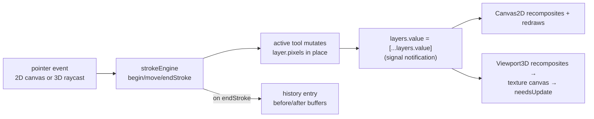

# Architecture

A hacking guide for Skin Studio. Read this top to bottom once (~15 min) and
you'll know where everything lives and which rules keep it working.

## The mental model

The entire document is **one 64×64 RGBA image** — the standard Minecraft skin
texture — represented as a stack of layers. Everything else is a view of it:

- The **2D canvas** draws the composited image zoomed with a grid.
- The **3D model** uses the *same* composited image as its texture. There is no
  separate 3D paint path: painting "on the model" just raycasts the cursor to a
  texel coordinate and runs the same stroke code the 2D canvas runs.

So the whole app is a loop:



State lives in **@preact/signals** at module scope (`document.ts`,
`toolState.ts`, `history.ts`) — not in components, not in a store library.
Components read `signal.value` and re-render automatically; core code
reads/writes the same signals directly. There is no serialization: a "document"
exists only in memory, and save/load is PNG export/import.

## Directory map

```
src/
  main.tsx              entry: render(<App/>)
  app.tsx               layout shell + Cmd/Ctrl+Z / Shift+Z keybinding
  core/                 all domain logic — DOM-free except io.ts, fully unit-testable
    skinLayout.ts       the 64×64 UV atlas: which rect is which body-part face
    document.ts         layer model + the app-state signals
    compositor.ts       blends the layer stack into one RGBA buffer
    strokeEngine.ts     stroke lifecycle; owns undo capture; dispatches to tools
    tools/              one file per tool (brush/eraser, fill, eyedropper, shade)
    history.ts          undo/redo stacks
    layerOps.ts         add/delete/duplicate/reorder/rename... (all push history)
    color.ts            HSV/HSL/hex conversions + the OKLCH shading math
    toolState.ts        active tool + per-tool option signals
    io.ts               PNG import (skinview-utils) and export (blob download)
  three/                3D, no Preact
    viewport.ts         renderer + cameras + orbit/pan/zoom input (Viewport class)
    playerModel.ts      skinview3d PlayerObject wrapper + the texture canvas
    paint3d.ts          pointer → texel raycast (the subtle part, see below)
    grids.ts            floor grid + per-texel wireframe overlay
  ui/                   Preact components, one per panel
    Canvas2D.tsx        zoomable 2D texture editor
    Viewport3D.tsx      3D panel; binds signals ↔ three objects, paint input
    Resizer.tsx         drag handle that resizes a panel via a CSS variable
    ToolStrip.tsx       tool buttons + per-tool options + swatches + undo/redo
    ColorPicker.tsx     hue ring + SV triangle, hand-rendered on a canvas
    LayerPanel.tsx      layer list (visibility, blend, opacity, reorder...)
    BodyPartsPanel.tsx  paper-doll part visibility toggles
    TopBar.tsx          New / Import / Export / Steve↔Alex
    Icon.tsx            Material Symbols SVGs inlined via ?raw imports
```

Line counts are small on purpose — the biggest file is ~270 lines. When adding
a feature, keep logic in `core/` (testable) and only wiring in `ui/`.

## core/skinLayout.ts — the texture atlas

Minecraft skins pack six body parts × two skin layers ("inner" = the body,
"outer" = the jacket/hat overlay) into the 64×64 texture as unwrapped boxes.
`PART_DEFS` holds each part's box size and the origin of its inner/outer
region; `boxFaces()` derives the six face rects from the standard unwrap
formula (documented at the top of the file). Nothing else in the app hardcodes
texture coordinates — everything queries this module:

- `allFaceRects(modelType)` — every face rect (cached). Canvas2D outlines,
  mannequin fill.
- `faceRectAt(x, y, m)` — which face a texel belongs to. Fill's
  "limit to part".
- `W`, `H` — always 64; imported everywhere rather than repeated as literals.

`ModelType` is `"default"` (Steve, 4px arms) or `"slim"` (Alex, 3px arms) —
same atlas layout, arms one texel narrower.

`validMask`, `partTexels`, `partBounds` are currently **unused** helpers built
for planned features (dead-pixel masking, part-scoped ops); use them before
writing new rect math.

## core/document.ts — layers and state

```ts
interface PixelLayer {
  id: string;           // "l1", "l2", ... (monotonic, session-local)
  kind: "pixel";
  name: string;
  visible: boolean;
  opacity: number;      // 0..1
  blend: BlendMode;     // 12 Photoshop-style separable modes
  clipped: boolean;     // ⚠ stored + toggleable, but compositor ignores it (not implemented)
  pixels: RGBA;         // Uint8ClampedArray, W*H*4, the actual paint
  mask: RGBA | null;    // W*H grayscale; compositor honors it, but no UI creates one yet
}
```

Signals exported here are the app state: `layers`, `activeLayerId`,
`modelType`, `partVisible`, `layerGroupVisible`. A new document is one "Base"
layer pre-filled with a grey mannequin (`makeMannequinPixels`) so the model is
visibly paintable instead of black.

### The one convention that matters

Layer **objects** are immutable — property changes go through `layerOps.ts`,
which replaces the object (`layers.value = layers.value.map(...)`). But layer
**pixel buffers** are mutated in place during a stroke (immutable buffers would
mean allocating 16 KB per pointermove). Since signals compare by identity, a
mutation alone notifies nobody; the stroke engine follows every tool call with

```ts
layers.value = [...layers.value];
```

to force the update. If you ever mutate `pixels` yourself, you must do the
same — a "nothing repaints" bug is almost always a missing array-identity
refresh.

## core/compositor.ts — blending

`composite(layers, out?)` folds the stack bottom-to-top into a single RGBA
buffer: straight (non-premultiplied) alpha, source-over, with the layer's blend
function applied per the PDF/Photoshop model (source is blended with the
backdrop in proportion to backdrop coverage, then composited normally — that's
why `normal` is `null` and skips the step). Layer `opacity` and `mask`
multiply into source alpha.

Callers pass their own `out` buffer when they keep the result around
(Canvas2D, strokeEngine); calling without `out` returns a **shared module
scratch buffer** that the next bare `composite()` call overwrites. Viewport3D
uses the scratch and immediately copies it into the texture canvas, holding a
reference only for alpha lookups — fine, because every recomposite refreshes
it. Don't stash the scratch anywhere that outlives the frame.

The blend-mode list (`BLEND_MODES`) is derived from the function table, so
adding a mode = one entry in `BLEND_FNS` + the `BlendMode` union in
`document.ts`; the LayerPanel dropdown picks it up automatically.

## Tools and the stroke engine

A tool is three-to-four callbacks operating on texel coordinates
(`core/tools/toolTypes.ts`):

```ts
interface Tool {
  onDown(x, y, ctx); onMove(x, y, ctx); onUp(ctx);
  onBreak?();   // reset line-continuity without ending the stroke (3D seam jump)
}
```

`ctx: StrokeContext` is rebuilt from the option signals on every call by
`strokeEngine.makeCtx` — tools never import signals themselves, which keeps
them pure and directly unit-testable. `ctx.pixels` is the **active layer's**
buffer (mutate it); `ctx.composite` is a read-only snapshot of the full
composite taken at stroke start (what the eyedropper samples, so it picks the
color you *see*, not the active layer's).

`strokeEngine.ts` owns the lifecycle:

1. `beginStroke` — snapshot the active layer's pixels (`strokeBefore`) and the
   composite, then `tool.onDown`.
2. `moveStroke` — `tool.onMove`. Tools that draw continuous strokes
   (brush/eraser/shade) Bresenham-connect from their remembered last point so
   fast drags don't leave gaps.
3. `endStroke` — `tool.onUp`, then push **one** `pixels` history entry iff the
   buffer actually changed (`buffersEqual` guards no-op strokes).
4. `breakStroke` — called by Viewport3D when the 3D ray jumps across a UV seam
   (different mesh, or >12 texels in one frame): the tool forgets its last
   point so it doesn't draw a line across unrelated texture regions, but the
   stroke — and its single undo entry — continues.

Current tools:

- **brush / eraser** (`brush.ts`) — same dragged-stamp implementation with a
  different color function (eraser stamps `[0,0,0,0]`). Stamp is a
  `size × size` square, size 1–8. Exports `line()` (Bresenham) for reuse.
- **fill** (`fill.ts`) — two modes. *Matching color* is a 4-connected flood
  fill on `onDown` only; with "Stay inside one face" on, bounds are the clicked
  **face rect** (e.g. just the head's front face). *Whole body part* ignores
  existing colors and repaints every texel of the clicked part and skin layer —
  all six faces at once, via `partTexels`.
- **eyedropper** (`eyedropper.ts`) — writes `primaryColor` from
  `ctx.composite` on down *and* move (drag to scrub-sample).
- **shade** (`shade.ts`) — darken/lighten, see below. Keeps a module-level
  `visited` set so each texel shades **once per stroke** no matter how often
  the drag recrosses it; `onUp` clears it, `onBreak` deliberately doesn't
  (same stroke). Transparent texels are skipped, alpha preserved. The tool
  shades texels already on the canvas; the ToolStrip's separate "Shade the
  color" buttons apply the same `shadeRgb255` step to the *selected color*, so
  the next stroke paints the shaded tone.

### Adding a tool (checklist)

1. `toolState.ts` — add the id to `ToolId`; add signals for any options.
2. `core/tools/yourTool.ts` — implement `Tool`. Pure logic only.
3. `toolTypes.ts` + `strokeEngine.makeCtx` — extend `StrokeContext` if the
   tool needs options (note: `fill.test.ts` builds a literal `StrokeContext`,
   so the type change will surface there too).
4. `strokeEngine.ts` — register in the `tools` record.
5. `ToolStrip.tsx` — add to `TOOLS` (icon: import the SVG in `Icon.tsx`);
   add an `{activeTool.value === "yours" && ...}` options block if needed.
6. Add a `*.test.ts` next to it — drive `onDown/onMove/onUp` against a plain
   `Uint8ClampedArray`, no DOM needed (see `shade.test.ts` for the pattern).

Both views' pointer handling comes for free — anything routed through the
stroke engine works in 2D and 3D automatically.

## core/history.ts — undo/redo

Three entry kinds, one shape rule: every entry carries full `before` and
`after` values, so undo and redo are symmetric replays with no inverse-op
logic.

- `pixels` — one layer's buffer before/after a stroke (full 16 KB copies;
  at MAX_HISTORY=200 that's ~6 MB worst case, fine).
- `prop` — one scalar layer property (name/visible/opacity/blend/clipped).
- `structure` — the whole layer array (deep-cloned) + active id, for
  add/delete/duplicate/reorder.

Rule: **whoever changes state pushes history** — `strokeEngine` for strokes,
`layerOps` for everything layer-shaped. Direct signal writes (model type
switch, part visibility, Import/New replacing all layers via `replaceLayers`)
are *not* undoable today; if you add one that should be, push an entry at the
call site. Undo re-applies `.slice(0)` copies so the stacks stay pristine even
though live buffers get mutated afterward.

## core/color.ts — color math and the shade algorithm

Hand-rolled fast HSV↔RGB for the per-pixel picker rendering; culori for
HSL/hex/OKLCH (its converters are the accuracy reference, the hand-rolled path
is the speed one).

Shading (`shadeRgb255`) is an **anchor blend in OKLCH**, like mixing shadow or
highlight paint into the color: lerp L, C, and hue (shorter arc) toward an
anchor by `amount`. Repeated passes converge on the anchor and never clip or
grey out. Anchors:

| mode | darken | lighten |
|---|---|---|
| `value` | pure black `{l:0, c:0}` | pure white `{l:1, c:0}` |
| `temperature` | cool blue-black `{l:.13, c:.07, h:264}` | warm off-white `{l:.97, c:.05, h:105}` |

Temperature mode encodes the painter's rule "shadows cool, highlights warm";
greys have no hue so they adopt the anchor's directly. Out-of-gamut results
are chroma-clamped (`clampChroma`, preserves L and H). `shade.test.ts` pins
all of this down — including convergence after 60 passes.

## three/ — the 3D side

**viewport.ts** — a self-contained `Viewport` class (renderer, perspective +
orthographic cameras, OrbitControls, rAF loop). Input scheme: **left-drag** is
decided per-press (paint vs orbit — see below), **right-drag** rotates,
**middle-drag** and **shift+wheel** pan, and **wheel zooms**. Mouse wheels send
~100 per notch while a trackpad pinch (ctrl+wheel) sends single digits, so the
two use different exponent factors — one shared value makes one of them
unusable. Lighting is a single ambient at intensity π — under three's physical
lighting that reproduces texture colors *exactly*, so the model matches the 2D
canvas; don't add directional lights or colors will shift. View presets snap to
orthographic (they're for reading proportions). A `ResizeObserver` on the
container drives `resize()`: panels are user-resizable, and that fires no
window resize — without it the canvas keeps three's default 600×300 and the
cameras keep an aspect of 0.

**playerModel.ts** — wraps skinview3d's `PlayerObject`. The texture is a
`CanvasTexture` over a 64×64 canvas; repainting = `putImageData` + `texture
.needsUpdate = true` (`markTextureDirty`). NearestFilter keeps pixels crisp.
The model natively faces +Z — don't rotate it, the view presets' labels depend
on it. Cape/elytra meshes are hidden (untextured white otherwise) — note this
hides the *group*, which is why `paint3d` must walk ancestors. The constructor
also alpha-tests each **inner**-layer material: skinview3d ships it fully
opaque, so a texel erased to alpha 0 rendered as solid *black* instead of
reading as empty.

**paint3d.ts** — `raycastTexel` converts a pointer event to a texel via the
hit's UV. It is the most bug-prone file in the project; four separate rules
each exist because breaking them produces paint landing somewhere other than
where you clicked:

1. **Walk ancestors for visibility, not just `hit.object.visible`.** skinview3d
   hides the cape and elytra by toggling their *parent group*, so those meshes
   keep `visible === true` themselves. The hidden cape hangs behind the body,
   so checking only the leaf let it intercept every click on the model's back —
   and because a cape unwraps to the texture's top-left, that paint landed on
   the head. This was the "I paint on the back of the arm and it paints the
   side of the head" bug. `isVisible()` walks the parent chain.
2. **Reject back-facing hits.** Outer-layer meshes are `DoubleSide`, so a ray
   passing through a transparent near face also registers hits on the *inside*
   of the far wall — painting the opposite side of the model.
3. **Pass through transparent texels on alpha-tested layers.** A hit on an
   alpha-tested mesh whose composite alpha is 0 is a hole the eye sees through,
   so the ray continues. If *nothing* opaque is hit, fall back to the nearest
   hit so a fresh blank outer layer is still paintable (hide the inner layer to
   reach it). `Viewport3D` supplies the `alphaAt` lookup from its cached
   composite.
4. **Refresh `camera.updateMatrixWorld()` before casting.** A pointer event can
   arrive before the next animation frame has refreshed a camera that just
   moved (e.g. clicking straight after a view preset).

`paint3d.test.ts` pins rules 1–3 headlessly with plain three.js meshes and a
stubbed canvas — no DOM or skinview3d needed.

**grids.ts** — floor grid + per-texel wireframe boxes. Wires are added as
*siblings* of each mesh (`Object3D.add` reparents — collecting them into a
group would yank them out of the model's coordinate space). Per part, only the
outermost *visible* layer's wire shows, to avoid nested-box z-fighting.

**Viewport3D.tsx** glues it together: three objects live in a `stateRef`
created once on mount; `useSignalEffect` blocks push signal changes into them
(recomposite → texture; model type → rebuild pixel grid, since arm geometry
changes; visibility toggles). Paint input: a **capture-phase** pointerdown on
the container raycasts *before* OrbitControls sees the press and flips
left-drag between paint (hit the model) and orbit (empty space) — that's how
one button does both.

## ui/ — notes per component

- **Canvas2D** — draws checkerboard, composite, face outlines, texel grid,
  hover cursor into one canvas; recomposites into its own buffer via
  `useSignalEffect` on `layers`. Zoom is cursor-anchored; middle/right-drag
  pans. Pointer events convert to fractional texel coords and feed the stroke
  engine.
- **ColorPicker** — hue ring + SV triangle rendered per-pixel; barycentric
  coordinates map position ↔ HSV (the file comments derive it). The picker
  owns a sticky `pickerHue` signal because greys/black/white round-trip
  through `primaryColor` with no derivable hue. Its size follows the panel
  width (clamped 130–320 px) via a `ResizeObserver`; pointer handlers bind once
  so they read the live size from a ref rather than a captured value.
- **ToolStrip / LayerPanel / TopBar** — thin signal wiring; nothing tricky.
  LayerPanel renders the list reversed (top layer first, like Photoshop).
- **BodyPartsPanel** — the doll is a CSS grid sized 8 px per texel so
  proportions match the model (arms narrow on Alex). "Body" and "Outer layer"
  are **independent toggles, not tabs**: either, both, or neither can be on.
  When both are on, each cell nests the body block inside the outer layer's
  frame, so the ring toggles the overlay and the block toggles the body.
- **Resizer.tsx** — a drag handle between two grid columns. It writes a pixel
  width into a CSS custom property (`--left-w`, `--v2d-w`, `--right-w`) on its
  parent; the layout decides which track reads that property, so the component
  stays layout-agnostic.
- **Icon.tsx** — Material Symbols imported as raw SVG strings at build time:
  they inherit `currentColor` and ship in the bundle (this matters for the
  single-file build — no icon font, no CDN).

Convention: canvas/three-heavy components keep imperative objects in refs and
bind signals with `useSignalEffect`; plain panels just read `signal.value` in
JSX. Transient UI state (zoom, hover, active tab) is component-local; anything
the domain or another panel cares about is a core signal.

## Testing

`npm test` (vitest, no DOM emulation needed — core is browser-API-free):

- `compositor.test.ts` — alpha compositing and blend math.
- `tools/fill.test.ts` — flood fill, face-rect limiting, whole-part fill.
- `shade.test.ts` — shading math (direction, temperature, gamut, convergence)
  and the once-per-stroke visited semantics via the `Tool` callbacks.
- `three/paint3d.test.ts` — raycast hit selection: ancestor visibility, nearest
  surface, alpha pass-through, back-face rejection.

The pattern for new logic tests: build a bare `Uint8ClampedArray`, a literal
`StrokeContext`, call the tool/function, assert on bytes. three.js code is
testable the same way — geometry and raycasting need no DOM, and a canvas can
be stubbed down to `getBoundingClientRect`.

In dev builds only, `main.tsx` and `Viewport3D` publish `window.__skin`
(document + compositor modules) and `window.__skin3d` (viewport + model). They
exist so browser-driven checks can read the exact composited texture and camera
state instead of inferring it from rendered pixels — which is how the cape bug
above was finally pinned down. Both are stripped from production by their
`import.meta.env.DEV` guard.

`npm run build` runs `tsc --noEmit` first, so type errors fail the build (and
the deploy workflow).

## Build & deploy

Covered in [README.md](README.md). The short version: `vite.config.ts` sets
`base: "./"` and `vite-plugin-singlefile`, so `npm run build` emits **one
self-contained `dist/index.html`** that works on GitHub Pages *and*
double-clicked from disk. Keep both settings — code that assumes absolute
URLs, runtime `fetch`es of assets, or web workers would break the offline
file. Pushing to `main` auto-deploys via `.github/workflows/deploy.yml`.

## Known loose ends

- `layer.clipped` is stored, toggleable, and undoable — but the compositor
  ignores it (clipping masks were scaffolded, never implemented). No UI
  exposes it.
- `layer.mask` is honored by the compositor but no UI creates or edits masks.
- `react-colorful` in `package.json` is unused (the custom picker replaced
  it) — safe to remove.
- `validMask` / `partBounds` in `skinLayout.ts` are unused helpers awaiting
  features (`partTexels` now backs the whole-part fill).
- Not undoable: model-type switch, part visibility, Import/New (see history
  section).
